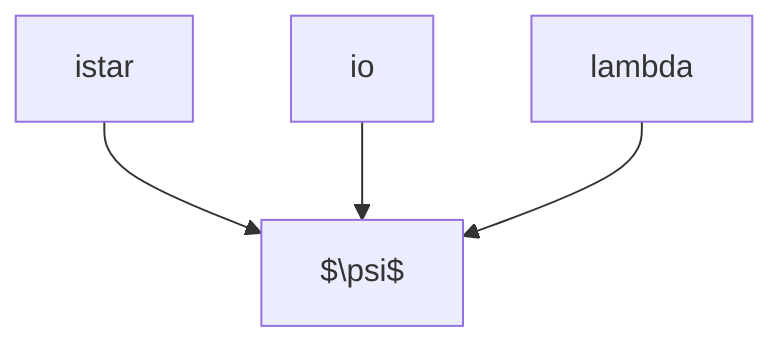

# coPsi
Stellar rotation, inclination, and orientation.




### Installation
`cd /path/to`

`git clone https://github.com/emilknudstrup/coPsi.git`

`cd /path/to/coPsi`

`python -m pip install .`

`pip install -r requirements.txt`


```python
import coPsi

## Data

## Instantiate iStar with values for Teff and vsini
dat = coPsi.Data()
## Read in data file
dat.readData('phot/KELT-11_cad_120sec_rotation.txt')
## Plot the data and return the axis
ax = dat.plot(return_ax=1)
## Apply a Savitsky-Golay filter
dat.filterData()
## Plot again on the same axis to compare
dat.plot(ax=ax)
## Fill the gaps (here for TESS downlink)
dat.fillGaps()
dat.plot(ax=ax)

## Rotation

## Instantiate Rotator object, here it inherits from the Data attributes
rot = coPsi.Rotator(x=dat.x,y=dat.y)

## Calculate autocorrelation
rot.ACF()
## Smooth autocorrelation
rot.smoothACF()
## Plot (both) autocorrelation
rot.plotACF()
## Calculate periodogram
rot.periodogram()
## Plot periodogram
rot.plotPeriodogram()
## Fit a Gaussian to periodogram
rot.fitProt()
## Plot periodogram again with result from fit
rot.plotPeriodogram()

```


```python
import coPsi

## Rotation

## Instantiate Rotator object, here we read the data directly as Rotator inherits from the Data class
rot = coPsi.Rotator('phot/KELT-11_cad_120sec_rotation.txt')
## Same steps are carried out here as in the data preparation steps in Data
rot.prepData()
## Again same steps are carried out here for the rotation steps above
rot.getProt()
## Plot autocorrelation
rot.plotACF()
## Plot periodogram
rot.plotPeriodogram()


```

```python
import coPsi

## Masuda & Winn 

## Instantiate iStar with values for Rs, Prot, and vsini
incs = coPsi.iStar(Rs=(2.082,0.061,1,4,'gauss'),
				   Prot=(6.7,0.6,1,12,'gauss'),
				   vsini=(6.0,0.4,1,12,'gauss'))

## Calculate the stellar incliation using the approach in Masuda & Winn (2020)
## This will do an MCMC (using emcee) and output the results in a csv file
## it will also (by default) create a corner plot and autocorrelation plot (for convergence)
incs.stellarInclination()

```


```python
import coPsi
import numpy as np
## Louden

## Instantiate iStar with values for Teff and vsini
incs = coPsi.iStar(Teff=(6250,100,0,7000,'gauss'),vsini=(6.0,0.5,0,7000,'gauss'))
## Create distributions for Teff and vsini
incs.createDistributions()
## Compare to relation from Louden
incs.plotLouden(Teff=6250,vsini=6.0,sTeff=100,svsini=0.5)
## Calculate the stellar incliation using the Louden et al. (2021) relation
incs.stellarInclinationLouden()
## Calculate median and credible interval and plot the resulting KDE
incs.diagnostics('incs')

## Let's say we also have distributions for lambda and the orbital inlination 
## of a length similar to the distributionk for the stellar inclination
## (here we'll simulat them)
incs.dist['lam'] = np.random.normal(-192,5,len(incs.dist['incs']))
incs.dist['inco'] = np.random.normal(81.81,0.12,len(incs.dist['incs']))

## Now let's calculate the obliquity psi
incs.coPsi()
incs.diagnostics('psi')


```


```python
import coPsi

## Inclination directly (but not entirely correct)

## You can parse your own distributions
## If, for instance, you have values for the obliquity and inclination
## from an MCMC run
## Here we will simulate those distribution outside of `coPsi`
## ..which here will be normally distributed, but they can have any form
import numpy as np
N = 20000
lam = np.random.normal(20,5,N)
inc = np.random.normal(84,1,N)

## Instantiate iStar with values for Rs and Prot
incs = coPsi.iStar(Rs=(2.082,0.061,1,4,'gauss'),
				 Prot=(6.7,0.6,1,12,'gauss'))
## We will then create distributions for Rs and Prot
incs.createDistributions()
## and calculate the distribution for the stellar inclination using the `simple` approach
incs.stellarInclinationDirectly()
## Calculate median and credible inter and plot the resulting KDE
incs.diagnostics('incs')


```
